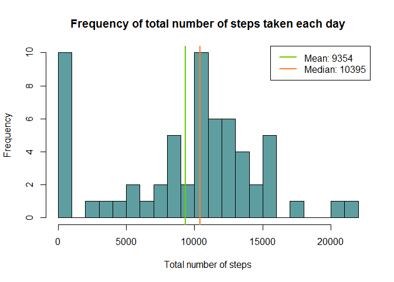
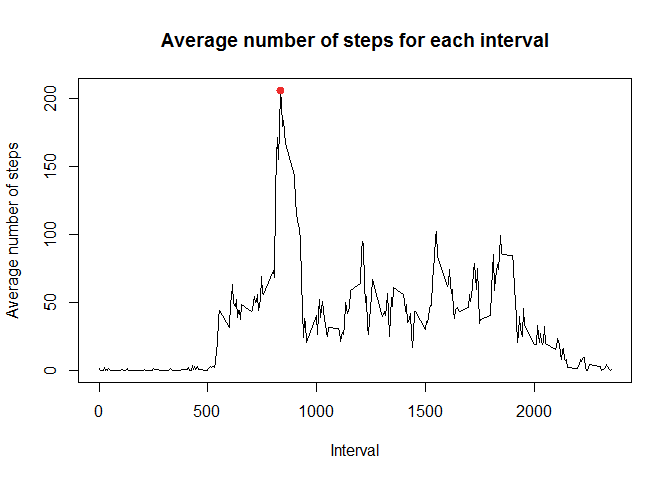
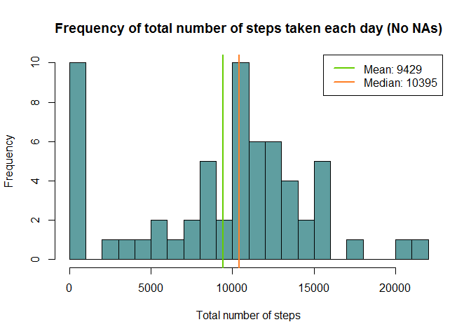
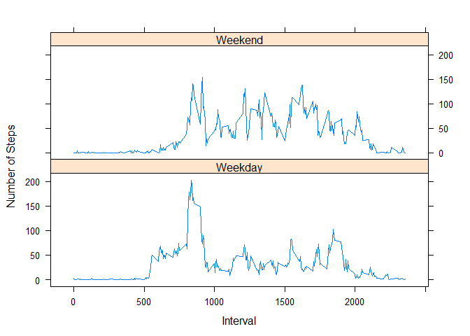

# Reproducible Research: Peer Assessment 1


Author: Stefan Stavrev

Date:   April 2015

## Loading and preprocessing the data

---

The dataset was downloaded from [here](https://d396qusza40orc.cloudfront.net/repdata%2Fdata%2Factivity.zip).

### Dataset description

This dataset description was taken from the website for the Coursera course Reproducible Research (Johns Hopkins University)
taught by Roger D. Peng, Jeff Leek and Brian Caffo, in April 2015.

*This assignment makes use of data from a personal activity monitoring device. This device collects data at 5 minute intervals through out the day. The data consists of two months of data from an anonymous individual collected during the months of October and November, 2012 and include the number of steps taken in 5 minute intervals each day.*

The variables included in this dataset are:

1. **steps**: Number of steps taking in a 5-minute interval (missing values are coded as NA)
2. **date**: The date on which the measurement was taken in YYYY-MM-DD format
3. **interval**: Identifier for the 5-minute interval in which measurement was taken

The dataset was extracted in the R working directory. Then, it was loaded and checked in R. Also, the date variable/column was converted to type Date. Missing values were present in the dataset and properly read as NA in R.


```r
library(data.table)
data <- read.csv("activity.csv", header=T, sep=",", na.strings = "NA", nrows=17569, stringsAsFactors=F)
data$date <- as.Date(data$date)
data <- data.table(data)
str(data)
```

```
## Classes 'data.table' and 'data.frame':	17568 obs. of  3 variables:
##  $ steps   : int  NA NA NA NA NA NA NA NA NA NA ...
##  $ date    : Date, format: "2012-10-01" "2012-10-01" ...
##  $ interval: int  0 5 10 15 20 25 30 35 40 45 ...
##  - attr(*, ".internal.selfref")=<externalptr>
```

```r
head(data)
```

```
##    steps       date interval
## 1:    NA 2012-10-01        0
## 2:    NA 2012-10-01        5
## 3:    NA 2012-10-01       10
## 4:    NA 2012-10-01       15
## 5:    NA 2012-10-01       20
## 6:    NA 2012-10-01       25
```

## What is mean total number of steps taken per day?

---

This task is divided into three subtasks:

1. Calculate the total number of steps taken per day.

2. Make a histogram of the total number of steps taken each day.

3. Calculate and report the mean and median of the total number of steps taken per day.

### Subtask 1: Calculate the total number of steps taken per day

The data is grouped by date and then total sum of steps for each day is computed. The result is a new object in R named
"stepsPerDay" which has two columns: "date"" and "stepsPerDay".


```r
stepsPerDay <- data [, list(stepsPerDay = sum(steps, na.rm=TRUE)), by=date]
str(stepsPerDay)
```

```
## Classes 'data.table' and 'data.frame':	61 obs. of  2 variables:
##  $ date       : Date, format: "2012-10-01" "2012-10-02" ...
##  $ stepsPerDay: int  0 126 11352 12116 13294 15420 11015 0 12811 9900 ...
##  - attr(*, ".internal.selfref")=<externalptr>
```

### Subtasks 2 and 3: Make a histogram of the total number of steps taken each day. Calculate and report the mean and median of the total number of steps taken per day

First, the mean and median values are computed and reported.


```r
stepsPerDayMean <- as.integer(mean(stepsPerDay$stepsPerDay))
stepsPerDayMedian <- as.integer(median(stepsPerDay$stepsPerDay))
```


```r
stepsPerDayMean
```

```
## [1] 9354
```

```r
stepsPerDayMedian
```

```
## [1] 10395
```

The mean of the total number of steps per day, is 9354 and the median is 10395.

Then, a histogram plot was created and the mean and median values were also included in the plot.


```r
hist(stepsPerDay$stepsPerDay, main="Frequency of total number of steps taken each day", xlab = "Total number of steps", col = "cadetblue", breaks=30)
abline(v=stepsPerDayMean, lwd = 2, col = "chartreuse3")
abline(v=stepsPerDayMedian, lwd = 2, col = "chocolate1")
legend("topright", lty = 1, lwd = 2, col = c("chartreuse3", "chocolate1"), legend = c(paste("Mean:", stepsPerDayMean), paste("Median:", stepsPerDayMedian)))
```

 

## What is the average daily activity pattern?

---

There are two subtasks for this task:

1. Make a time series plot (i.e. type = "l") of the 5-minute interval (x-axis) and the average number of steps taken, averaged across all days (y-axis).

2. Which 5-minute interval, on average across all the days in the dataset, contains the maximum number of steps?


```r
## Group by interval and compute mean values for steps.
dataByInterval <- data[, list(avgSteps = mean(steps, na.rm=TRUE)), by=interval]

## Plot intervals and average steps.
plot(dataByInterval$interval, dataByInterval$avgSteps, type="l", xlab="Interval", ylab="Average number of steps", main="Average number of steps for each interval")

## Mark the maximum average steps value.
maxAvgSteps = dataByInterval[which.max(avgSteps), ]
maxAvgSteps$avgSteps <- as.integer(maxAvgSteps$avgSteps)
points(maxAvgSteps$interval,  maxAvgSteps$avgSteps, col = 'firebrick2', lwd = 2, pch = 19)
```

 


```r
maxAvgSteps$interval
```

```
## [1] 835
```

```r
maxAvgSteps$avgSteps
```

```
## [1] 206
```

The wanted time interval with maximum number of steps is 835 with value for steps 206.

## Imputing missing values

---

There are 4 subtasks for this task:

1. Calculate and report the total number of missing values in the dataset (i.e. the total number of rows with NAs).

2. Devise a strategy for filling in all of the missing values in the dataset. The strategy does not need to be sophisticated. For example, you could use the mean/median for that day, or the mean for that 5-minute interval, etc.

3. Create a new dataset that is equal to the original dataset but with the missing data filled in.

4. Make a histogram of the total number of steps taken each day and Calculate and report the mean and median total number of steps taken per day. Do these values differ from the estimates from the first part of the assignment? What is the impact of imputing missing data on the estimates of the total daily number of steps?

### Subtask 1: Calculate and report the total number of missing values in the dataset


```r
nrMissing <- sum(is.na(data$steps) | is.na(data$date) | is.na(data$interval))
```

There are 2304 missing values in the dataset.

### Subtask 2 and 3: Devise a strategy for filling in all of the missing values in the dataset. Create a new dataset that is equal to the original dataset but with the missing data filled in

First, let's see which variable/column in the dataset contains NA values.


```r
sum(is.na(data$steps))
```

```
## [1] 2304
```

```r
sum(is.na(data$date))
```

```
## [1] 0
```

```r
sum(is.na(data$interval))
```

```
## [1] 0
```

We see that missing values are present only in the "steps" column. My strategy of filling these missing values is the following.
I will use the R object "dataByInterval" we created in step 2 of this project: "What is the average daily activity pattern?".
Each NA value in the "steps" column will be replaced with the corresponding mean value from "dataByInterval".


```r
dataWithoutNA <- data
dataWithoutNA[is.na(data$steps), 1] <- dataByInterval[is.na(data$steps), 2]
```

Let's check to make sure there are no missing values in the new dataset "dataWithoutNA".


```r
sum(is.na(dataWithoutNA$steps))
```

```
## [1] 0
```

### Subtask 4: Make a histogram of the total number of steps taken each day and calculate and report the mean and median total number of steps taken per day


```r
stepsPerDay2 <- dataWithoutNA[, list(stepsPerDay = sum(steps, na.rm=TRUE)), by=date]
stepsPerDay2Mean <- as.integer(mean(stepsPerDay2$stepsPerDay))
stepsPerDay2Median <- as.integer(median(stepsPerDay2$stepsPerDay))
```


```r
stepsPerDay2Mean
```

```
## [1] 9429
```

```r
stepsPerDay2Median
```

```
## [1] 10395
```


```r
hist(stepsPerDay2$stepsPerDay, main="Frequency of total number of steps taken each day (No NAs)", xlab = "Total number of steps", col = "cadetblue", breaks=30)
abline(v=stepsPerDay2Mean, lwd = 2, col = "chartreuse3")
abline(v=stepsPerDay2Median, lwd = 2, col = "chocolate1")
legend("topright", lty = 1, lwd = 2, col = c("chartreuse3", "chocolate1"), legend = c(paste("Mean:", stepsPerDay2Mean), paste("Median:", stepsPerDay2Median)))
```

 

Question 1: Do these values differ from the estimates from the first part of the assignment?

Yes.

Question 2: What is the impact of imputing missing data on the estimates of the total daily number of steps?

The median value remained the same 10395, while the mean value increased from 9354 to 9429.

## Are there differences in activity patterns between weekdays and weekends?

---

This task is divided into subtasks:

1. Create a new factor variable in the dataset with two levels - "weekday" and "weekend" indicating whether a given date is a weekday or weekend day.

2. Make a panel plot containing a time series plot (i.e. type = "l") of the 5-minute interval (x-axis) and the average number of steps taken, averaged across all weekday days or weekend days (y-axis). See the README file in the GitHub repository to see an example of what this plot should look like using simulated data.

### Subtask 1: Create a new factor variable in the dataset with two levels - "weekday" and "weekend"

Create a function that can tell if a day is a weekday or weekend.


```r
weekDayOrEnd = function(date){
  if(date == "Saturday" || date == "Sunday") return("Weekend")
  else return("Weekday")
}
```

Add the factor variable.


```r
dataWithoutNA$weekDayOrEnd <- factor(sapply(weekdays(dataWithoutNA$date), weekDayOrEnd))
head(dataWithoutNA)
```

```
##    steps       date interval weekDayOrEnd
## 1:     2 2012-10-01        0      Weekday
## 2:     2 2012-10-01        5      Weekday
## 3:     2 2012-10-01       10      Weekday
## 4:     2 2012-10-01       15      Weekday
## 5:     2 2012-10-01       20      Weekday
## 6:     2 2012-10-01       25      Weekday
```

### Subtask 2: Make a panel plot


```r
library(lattice)
dataWithoutNA2 = dataWithoutNA[, list(avgSteps = mean(steps, na.rm = TRUE)), by = list(interval, weekDayOrEnd)]
xyplot(avgSteps~interval | weekDayOrEnd, data = dataWithoutNA2, type = "l", xlab = 'Interval', ylab = 'Number of Steps', layout = c(1,2))
```

 
